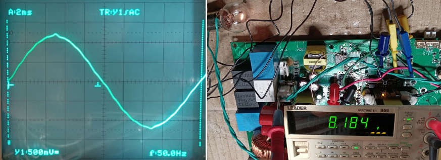

# PSA-700 Inverter Board Mod

This is the story of how I resurrected an inverter from a dead charging-station board—and learned STM32 along the way.

> **Prequel:** Before firmware development, the inverter schematic was fully reverse-engineered in a separate repository:  
> [PCB Reverse-Engineering Repo](https://github.com/alysenko4317/pcb-re/tree/main/ups_XO%20PSA-700)

---

## Background

The PSA-700 inverter board originally ran on an HC32F030 (a 5 V Chinese clone of the STM32F030). When that MCU failed, the entire inverter went silent. Rather than give up, I saw an opportunity:

> _“Let’s drop in an STM32F030, rewire the board, and bring this inverter back to life.”_

---

## 1. Power Supply Redesign

- **Original**: 78L05 → 5 V for HC32F030  
- **New**: AMS1117-3.3 → 3.3 V for STM32F030  

Replaced the 78L05 with an LM1117-3.3 on a small daughter board (pinout mismatch and extra decoupling capacitors required).

 Suddenly, the heart of the board had the right juice.

---

## 2. PCB & Pin-Rewiring

STM32F030’s timer pins didn’t match the original HC32F030 layout, so I re-routed the bridge gate lines to TIM16_CH1/CH1N and TIM17_CH1/CH1N. During that work, PB3 and PB4 became available—but there were no SMD pads, only lacquer-coated copper tracks. I used a fine engraving tool to remove the lacquer, expose tiny copper areas, and solder SMD LEDs with series resistors. It was extremely meticulous, jewel-like work.


> “If an interrupt fires, you’ll see a blink. No guesswork.”
  
To reliably connect PB6 & PB7 to the optoisolator inputs (instead of PB3/PB4), I added custom header pins directly onto those exposed tracks and secured them with a drop of super-glue. This let me clip on wiring harnesses and probes without lifting the fragile traces.


---

## 3. SWD Programming Connections

There was no dedicated SWD header on the original board, and the MCU’s SWDIO/SWCLK pins were already driving other functions. To enable reliable flashing and debugging:

- Individual single-pin headers were soldered directly to tiny SMD legs.  
- A custom spring-clip adapter cable (shown below) connects to those pins without lifting or stressing the fragile traces.

 
  

Now I could load firmware in seconds.

---

## 4. Firmware: Sinusoidal PWM

Before diving into sine modulation, I removed one of the optoisolators (the one driving the synchronous rectifier) because it’s not needed for pure inverter operation. Originally the board supported a reverse mode for battery charging; I plan to drop that function and may even replace the bridge with simple diodes in future.

Next, I wrote a minimal firmware to configure and start the carrier timers:

```c
// Test PWM setup
Bridge_Start();    // enable TIM16 & TIM17 at 16 kHz, complementary outputs, dead-time
// Probe PWM outputs to verify correct phase and dead-time
```

I confirmed on the oscilloscope that the PWM pulses are 180° out of phase and respect the configured dead-time (≈500 ns, too fast to see clearly).


After validating basic PWM, I implemented soft-start/stop:

```c
Bridge_SoftStart();  // ramp from 0→50%
Bridge_SoftStop();   // ramp back 50%→0
```

Finally, I encapsulated everything into **sinegen.c**, adding TIM6-driven interrupts at 5 kHz (100 samples × 50 Hz) to modulate the carrier via a sine lookup table, along with 1 s soft-start/stop ramps.

In `main.c`:

```c
SineGen_Init();    // build sine table
SineGen_Start();   // fire up bridge + TIM6
…later…
SineGen_Stop();    // ramp down and shut off
```

> **NOTE:** The core files `sinegen.c` and `sinegen.h` in `App/` are entirely hand-crafted; everything else in this project is mostly CubeMX-generated.  
> - [`sinegen.c`](https://github.com/alysenko4317/STM32-Inverter/blob/main/Inverter_F030_PSA/App/sinegen.c)  
> - [`sinegen.h`](https://github.com/alysenko4317/STM32-Inverter/blob/main/Inverter_F030_PSA/App/sinegen.h)

---

## 5. Watching the Waveform

- Raw gate signals show dead-time and complementary pulses.
- Add a simple RC filter (10 kΩ + 1 µF, fc≈16 Hz) on one gate line to see a clean 50 Hz sine.

> “That moment when the oscilloscope trace finally sings.”


---

## 6. Full-bridge inverter running with sine output

At this stage, the full bridge is fully operational. The PWM signals are driven through **EG3112 gate drivers**, switching MOSFETs, and an **output LC filter**. The screenshot below shows the waveform captured directly at the inverter output under real load — a 24 V / 15 W incandescent bulb.



```text
• Load: 24 V / 15 W incandescent bulb
• Measured output: ≈ 8.2 V RMS — the bulb glows at partial brightness
• Probe: 1:10 attenuation
• Vertical scale: 500 mV/div
• Peak-to-peak amplitude: 5 divisions × 500 mV × 10 = 25 Vpp
• Peak amplitude: 12.5 V → RMS ≈ 8.84 V (expected for ideal sine)
• Timebase: 2 ms/div — one full sine cycle fits across ~10 divisions
```

> 💡 The difference between the calculated RMS (8.84 V) and the measured value (8.2 V) is due to minor waveform imperfections — slight asymmetry, peak rounding, or residual switching noise. This is expected behavior for a PWM-driven inverter and indicates real-world performance versus ideal math.

The waveform confirms correct gate drive sequencing, dead-time handling, and LC filtering. Overall, the inverter is now generating a clean, scaled-down sine wave with real load.

## What’s Next

- Read UART telemetry from the auxiliary HV-side controller  
  In this inverter design, an isolated auxiliary microcontroller performs measurements on the high-voltage side, including HV DC+, HV GND offset, load current, etc. Data is transmitted via an opto-isolated UART interface to maintain full electrical isolation.  
  The UART protocol has been successfully reverse-engineered using a logic analyzer and validated through targeted experiments. A Python script is available to read and parse the data stream on a PC:  
  👉 [Protocol analysis and Python script on GitHub](https://github.com/alysenko4317/pcb-re/tree/main/ups_XO%20PSA-700/soft)

- Implement diagnostic data output  
  After receiving telemetry in firmware, the next step is to output key diagnostics (measured voltages, current, fault states) either to a display or to a secondary board over I²C or similar interface. This will help verify real-time behavior and improve debugging and development workflow.

